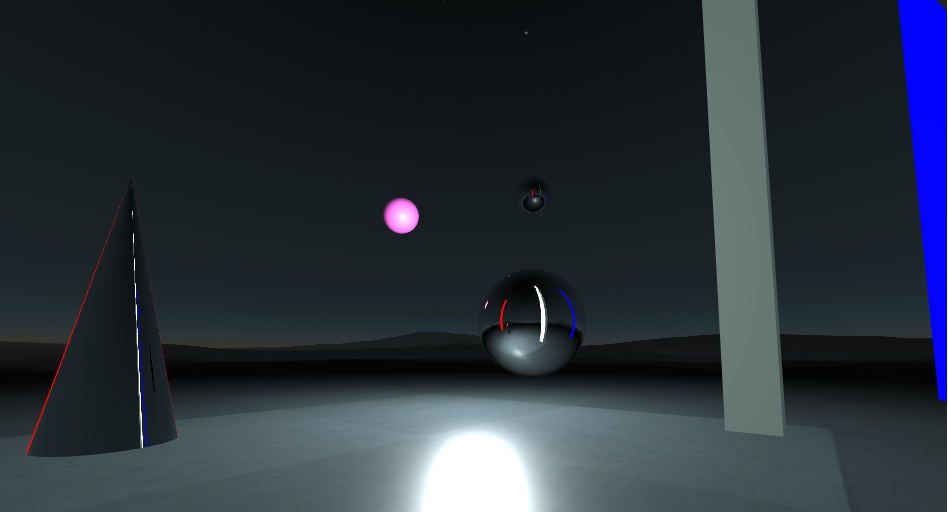

## aframe-mirror-component

[](https://npmjs.org/package/aframe-mirror-component)
[](https://npmjs.org/package/aframe-mirror-component)

Mirror effect material that works with THREE.CubeCamera snapshots of the scene.

Add it to a mesh and it will change its material for a mirror like effect.

If you use it let me know, I'm @alfredofrlp on twitter.

For [A-Frame](https://aframe.io).

[LIVE DEMO](https://alfa256.github.io/aframe-mirror-component/examples/basic/)
 : WASD + mouse to look around.



### API

| Property   | Description                  | Default Value |
| ---------- | ---------------------------- | ------------- |
| color      | material color               | #ffffff       |
| resolution | CubeCamera resolution        | 128           |
| refraction | material refractionRatio     | 0.95          |
| distance   | CubeCamera render distance   | 3000          |
| interval   | snapshot interval            | 1000 ms       |
| repeat     | take snapshot every interval | false         |

For a realtime mirror effect I suggest a low resolution ( 32~64 ) and an interval of 150~300, low distance also helps.


#### Browser

Install and use by directly including the [browser files](dist):

```html
<head>
  <title>My A-Frame Scene</title>
  <script src="https://aframe.io/releases/0.6.0/aframe.min.js"></script>
  <script src="https://unpkg.com/aframe-mirror-component/dist/aframe-mirror-component.min.js"></script>
</head>

<body>
  <a-scene>
    <a-sphere mirror></a-sphere>
  </a-scene>
</body>
```

<!-- If component is accepted to the Registry, uncomment this. -->
<!--
Or with [angle](https://npmjs.com/package/angle/), you can install the proper
version of the component straight into your HTML file, respective to your
version of A-Frame:

```sh
angle install aframe-mirror-component
```
-->

#### npm

Install via npm:

```bash
npm install aframe-mirror-component
```

Then require and use.

```js
require('aframe');
require('aframe-mirror-component');
```
